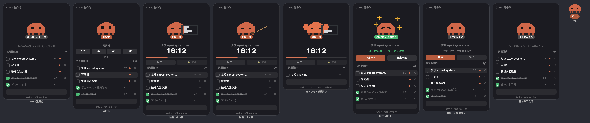
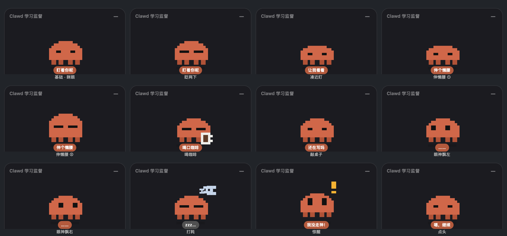
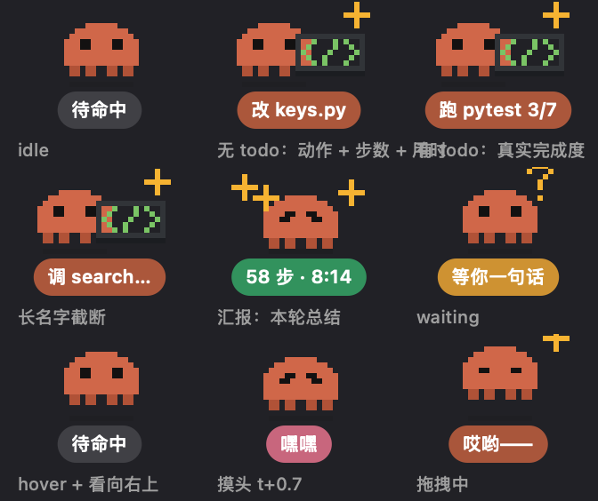

# study with clawd

一只住在 macOS 桌面上的像素 Clawd，陪你把今天要做的事做完。

三个东西，共用同一只 Clawd：

- **clawd** — 学习陪伴面板：今日清单、每项任务的专注计时、每天一份汇总。**裸的 Clawd**
- **claude-pet** — Claude Code 的进度挂件：Claude 在干活时冒出来报告进度，闲着自动消失。**显示器里的 Clawd**
- **[scriptable/](scriptable/)** — iPhone 上的 24 小时圆盘 + 主屏小组件。**不用 Xcode、不用 iCloud、不会过期**，手机装个免费 app 就行
- **[ios/](ios/)** — 同样功能的 SwiftUI 原生版，要 Xcode。两条路都留着，看你想走哪条

两只造型刻意做得不一样：学习那只就是 Clawd 本体，Claude Code 那只是一台显示器、Clawd 坐在屏幕里。同屏摆着也不会认错。

原生 Swift + AppKit，单文件，无第三方依赖。只需要 Xcode Command Line Tools。



## 它做什么

**今日清单**：底部输入框回车加一条，点方框打勾。**做完的不会消失**，只是沉到列表最下面——它仍然算数，只是不再跟没做的抢注意力。跨天时未完成的自动带到第二天。

**专注计时**：点任务右边 ▶ 选时长（15/25/45/60，或直接输入分钟数）。计时期间「休息」按钮是锁着的。时间到了会响一声，然后给你两个选择：休息一下，或者再来一段。

**书桌场景**：Clawd 坐在一张桌子后面，桌上有台灯、一摞书和一盆绿植。全是静态的，不会动，纯粹是让面板不那么空。不想要就 `clawd.sh scene off`。

计时期间 Clawd 会在旁边拿点东西：默认抱着电脑陪你一起写（body doubling 的做法），想要凶一点的可以换成皮鞭：`clawd.sh prop whip`。

**练出肌肉。** 一天累计专注满 2 小时，Clawd 会变成强壮形态：颜色更亮更清晰，两侧长出肱二头肌。累计的，几个短段拼起来也算数。

**每天一份汇总**：`clawd.sh summary` 输出一份 Markdown，每天一节，记录专注时长、完成情况和最长的一段。从日志文件实时生成，不会跟数据对不上。

## 几条刻意的设计

做之前查了面向 ADHD 的产品设计资料，有几条直接改变了实现：

**默认几乎不动。** 循环动画是这类指南里第一个要砍的东西——余光里不停动的东西会持续抢注意力。所以没有持续的呼吸起伏，待命时完全静止。

**小动作只在计时期间出现**——没有进行中的专注段时它一动不动，这是有意的。计时期间有 8 种随机小动作（伸懒腰、喝咖啡、打盹惊醒等），平均 16 秒来一个——那是偶发的一次性动作，不是循环动效，而且那时候你本来就在专注。想让它更活泼（约 5 秒一个，并加上持续起伏）：

```bash
clawd.sh motion on
```



**结束一段 ≠ 任务做完。** 面板上写的是「这一段结束了」，不是「完成」。任务算不算做完只能你自己去列表里勾——计时器无权替你下这个结论。

**不自动开始任何事。** 重启后没走完的计时段会停在「要接着来吗？」等你点，不会自己接着跑。

**只累加，不倒扣。** 底部统计是「完成 N · 专注 M 分钟 · 最长 X 分钟」。提前停下的那段专注时间照样计入——坐了 18 分钟就是坐了 18 分钟，不因为没走满就归零。中断次数记在数据文件里但界面上不显示：一个不断增长的失败计数是研究里点名会让人干脆弃用整个 app 的模式。

**陪着，但不盯着。** 文案从「盯着你呢」改成了「陪你一起」。Body doubling（有人陪着做事）本身是有依据的方法，但"陪"不需要"监视"。

参考：
[Neurodivergent UX Design](https://www.accessibilitychecker.org/blog/neurodivergent-ux-design/) ·
[Designing for ADHD in UX](https://uxpa.org/designing-for-adhd-in-ux/) ·
[ADHD Productivity Without Shame or Streaks](https://xenith.life/articles/adhd-productivity-systems) ·
[Body Doubling Apps](https://www.shimmer.care/blog/best-body-doubling-apps)

## 安装

```bash
git clone https://github.com/Myla0619/studywithclawd.git
cd studywithclawd
./build.sh install
~/.claude/clawd/clawd.sh start
```

`build.sh install` 会把源码、脚本和编译好的二进制放进 `~/.claude/{clawd,pet,shared}`。数据也存在那里，不会进仓库。

想开机自启，把 `clawd/com.clawd.study.plist` 里的 `__HOME__` 换成你的家目录，然后：

```bash
cp clawd/com.clawd.study.plist ~/Library/LaunchAgents/
launchctl load ~/Library/LaunchAgents/com.clawd.study.plist
```

## 用法

```
clawd.sh start | stop | restart | toggle
clawd.sh hide | show         藏起来 / 拿回来（进程不退，计时继续走）
clawd.sh motion [on|off]     动画开关（同时管两只）
clawd.sh prop [laptop|whip|none]  伴学时 Clawd 手上拿什么
clawd.sh scene [on|off]      书桌场景（台灯/书堆/绿植）
pet.sh linger [秒]           挂件那条"干完了"停留多久（默认 60）
clawd.sh find                面板找不到时把它叫回来（展开 + 回默认位置 + 置顶）
clawd.sh summary             打印每日汇总
clawd.sh today               今天的原始 JSON
clawd.sh build               改完源码重新编译
```

面板本身：拖标题栏移动，点右上角 `—` 收起成贴纸大小，**双击贴纸**展开（单击是拖动，所以挪位置不会误触）。**右键**弹菜单：隐藏 / 收起 / 退出。

「隐藏」和「收起」不一样：收起是变成小贴纸还在桌面上，隐藏是整个看不见但进程还在、计时照样走。计时到点它会自己冒出来告诉你，不会藏着把这段白计了。

收起后照样会做那些小动作，杯子、Zzz、感叹号会挪到身侧以免出界。

收起后的贴纸只有 112×76 且没有卡片底，桌面一乱很容易找不到——这时候 `clawd.sh find` 会把它展开、放回左上角并置顶。

## claude-pet（可选）

给 [Claude Code](https://claude.com/claude-code) 用的进度挂件，造型是**一台显示器、Clawd 坐在屏幕里**——干活时屏幕上会亮起绿色代码行，闲着屏幕就是黑的。Claude 开始干活时它出现在角落，底下一行字说明正在做什么（`改 keys.py`、`跑 pytest 3/7`），干完变成本轮总结（`58 步 · 5:02`），**停留 60 秒**让你来得及看见，然后自己消失。`pet.sh linger 120` 可以调更久。



装法是在 `~/.claude/settings.json` 里挂 6 个 hook：

```json
{
  "hooks": {
    "SessionStart":     [{ "hooks": [{ "type": "command", "command": "~/.claude/pet/pet.sh hook idle",    "async": true }] }],
    "UserPromptSubmit": [{ "hooks": [{ "type": "command", "command": "~/.claude/pet/pet.sh hook working", "async": true }] }],
    "PreToolUse":       [{ "hooks": [{ "type": "command", "command": "~/.claude/pet/pet.sh hook act",     "async": true }] }],
    "PostToolUse":      [{ "matcher": "TodoWrite",
                           "hooks": [{ "type": "command", "command": "~/.claude/pet/pet.sh hook todo",    "async": true }] }],
    "Notification":     [{ "hooks": [{ "type": "command", "command": "~/.claude/pet/pet.sh hook waiting", "async": true }] }],
    "Stop":             [{ "hooks": [{ "type": "command", "command": "~/.claude/pet/pet.sh hook done",    "async": true }] }]
  }
}
```

一台机器上开多个 Claude Code 会话时，状态按 `session_id` 分开存在 `pet/s/<id>/`，挂件会挑「最忙」的那个跟：正在干活 > 等你确认 > 刚干完 > 待命，同级比新鲜度。

## 一些实现细节

**像素不糊**：所有位移都按整格走，精灵坐标对齐到格子，不做小数缩放。高矮胖瘦不是拉伸——只有中间那段直筒身体增减行数，圆顶和腿是固定的，所以三种体态都保持在模。

**28 格的网格**：Clawd 画在 28 格宽的网格上，面板里每格 3pt、贴纸里 2pt。之前是 14 格 6pt——一样大，但轮廓的台阶粗一倍。

**不占资源**：两个都跑 10fps（像素动画整格跳，30fps 和 10fps 画出来一样）。挂件隐身时不跑动画，轮询也降频。闲置时两个加起来约占单核 1.5%。

**离屏预览**：改完外观不用反复重启看效果。

```bash
clawd/clawd --sheet out.png     # 所有面板状态渲染成一张图
clawd/clawd --beats out.png     # 所有随机小动作
clawd/clawd --trace 600         # 纯内存模拟 10 分钟，打印触发了哪些动作
pet/claude-pet --sheet out.png        # 挂件的所有状态
pet/claude-pet --trace-linger 60      # 验证汇报停留时长
```

**点击穿透**：挂件只在鼠标真正压在 Clawd 身上时才拦截点击，其余时候整个窗口穿透，不挡你点桌面上的东西。靠轮询光标坐标实现，不需要辅助功能权限。

## 数据

都在 `~/.claude/` 下，纯文本，随时可以自己看或改：

```
clawd/days/<yyyy-MM-dd>.json   每天的清单和统计
clawd/summary.md               自动生成的汇总
clawd/session.json             进行中的计时段（重启不丢）
pet/s/<session_id>/            各 Claude 会话的状态
```

## 许可

MIT
